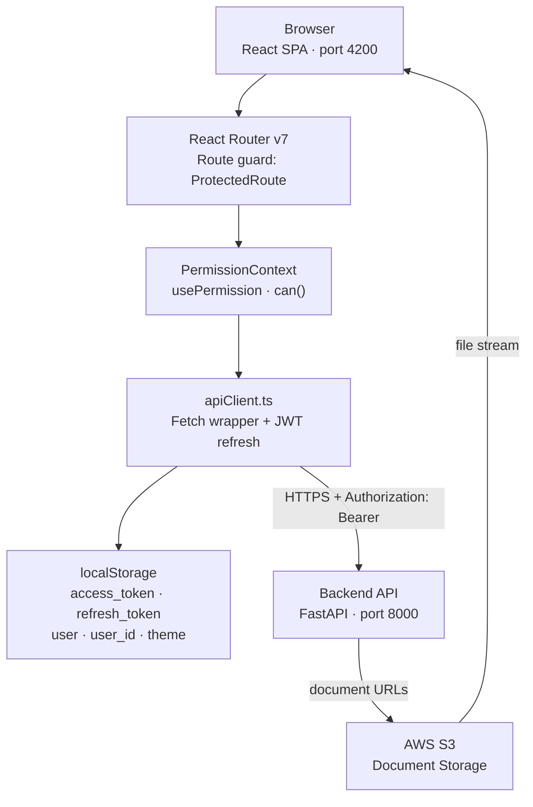
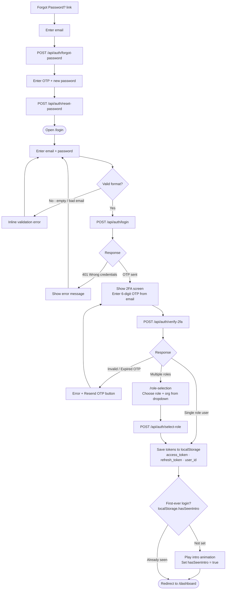
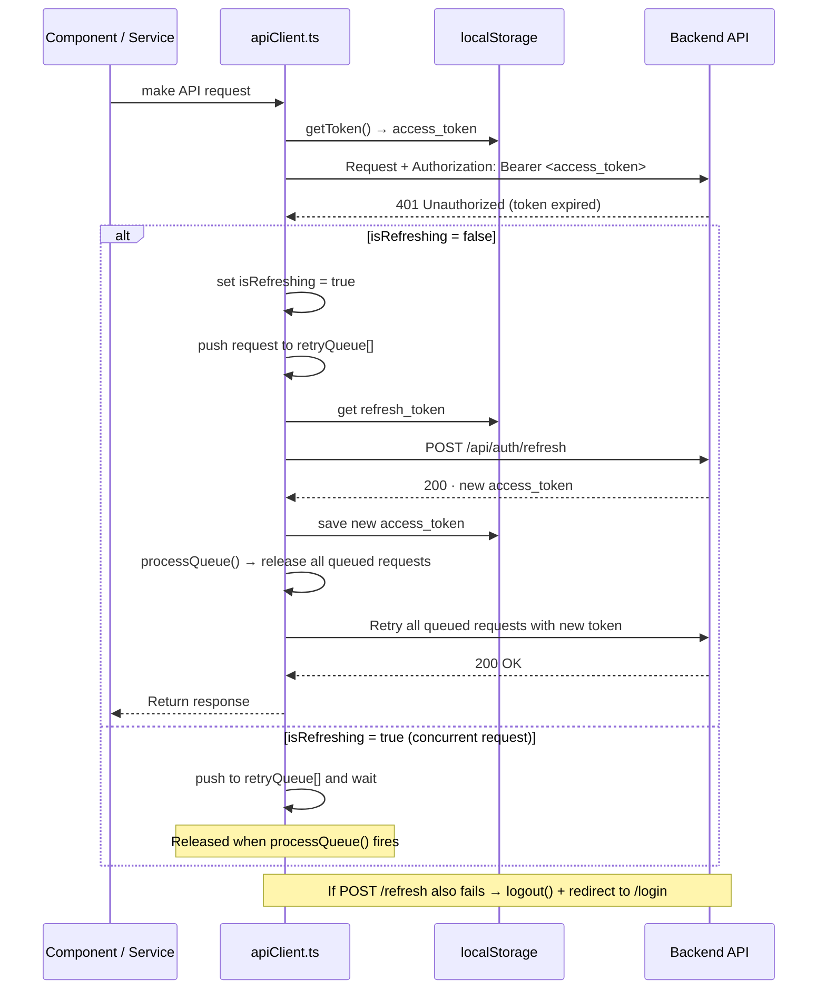

# docucr Frontend

The modern, responsive single-page application for the **docucr** document processing platform. Built with React 18 and TypeScript, it delivers a seamless experience for intelligent document management, AI-powered extraction, multi-tenant administration, and real-time collaboration.

---

## Table of Contents

1. [Key Application Modules](#key-application-modules)
2. [Module Functionality Guide](#module-functionality-guide)
3. [Tech Stack](#tech-stack)
4. [Project Structure](#project-structure)
5. [Complete Routing Structure](#complete-routing-structure)
6. [Components Reference](#components-reference)
7. [Services Reference](#services-reference)
8. [Authentication Implementation](#authentication-implementation)
9. [State Management](#state-management)
10. [HTTP Layer — API Client & Interceptors](#http-layer--api-client--interceptors)
11. [Environment Variables](#environment-variables)
12. [npm Scripts](#npm-scripts)
13. [Local Development Setup](#local-development-setup)
14. [Building for Production](#building-for-production)
15. [Docker Deployment](#docker-deployment)
16. [Styling Approach](#styling-approach)
17. [TypeScript Configuration](#typescript-configuration)
18. [Forms & Validation](#forms--validation)

---

## Key Application Modules

### Authentication
- Multi-step login: email + password → two-factor OTP → role selection
- Forgot password and reset password with OTP verification
- Session persistence via localStorage (access + refresh tokens)
- Automatic token refresh on 401 responses

### Document Center
- **Document List** — filterable, paginated table of all uploaded documents (by status, type, client, template, date, search)
- **Document Upload** — drag-and-drop multi-file uploader with real-time upload progress per file
- **Document Detail** — side-by-side document viewer + extracted field data; includes action log, metadata editing, printing, and sharing
- **Shared With Me** — view documents shared internally by other users

### Templates & Document Types
- Create and manage document extraction templates with field-level schema definitions
- Manage document types with activate/deactivate lifecycle

### Forms
- Dynamic form builder: create forms with custom fields (text, textarea, number, email, select, checkbox, radio, date)
- Per-field: label, placeholder, required flag, options, validation rules, display order
- Form activation — one active form at a time linked to document processing

### Standard Operating Procedures (SOPs)
- Create/edit SOPs with provider info, workflow, billing guidelines, payer guidelines, CPT/ICD coding rules
- Upload supporting SOP documents and trigger AI-powered extraction
- Read-only SOP view for non-editors
- Client and provider selection/linking per SOP

### Clients & Organisations
- Client management with NPI lookup, multiple locations, provider mappings
- User-to-client assignment
- Bulk client import
- Organisation management (superadmin only) — activate/deactivate orgs

### Users & Permissions (RBAC)
- User CRUD with role assignment, status management, and client mapping
- Role management with module-level and submodule-level privilege configuration
- Privilege viewer
- Change password (admin override)

### Activity Logs
- System-wide audit trail with filters: action, entity type, user, date range, entity ID

### Settings
- **Webhooks** — create, update, delete webhooks with event subscriptions
- **Printers** — configure network printers (RAW/IPP/LPD), test connection, discover via mDNS
- **Document List Config** — configure which columns appear in the document list view

### Profile
- View and update personal details (name, phone)
- Upload and crop profile image
- Change own password

### Public Share
- Token-based, password-protected external document sharing
- Accessible without login at `/public/share/:token`

---

## Application Architecture



---

## Module Functionality Guide

This section explains what each screen and module in the application does, how a user would use it, what they can see, and what actions they can take. This is the go-to reference for understanding the application's behaviour from a user perspective.

---

### Module 1 — Authentication (Login Page)

**Route:** `/login`
**Component:** `Login.tsx`

**What the user sees:**
A clean login screen with the docucr branding. The login process is broken into multiple steps — each step appears on the same page, replacing the previous one.

**Step-by-step user experience:**

**Step 1 — Enter Credentials:**
- The user enters their email address and password.
- If either field is empty or the email format is invalid, inline validation errors appear immediately.
- On submit, the system sends the credentials to the backend.

**Step 2 — Two-Factor Authentication (2FA):**
- After a successful credential check, the user sees a "Enter the OTP sent to your email" screen.
- A 6-digit code is shown in their inbox. They type it into the input field.
- If the OTP is wrong or expired, an error message appears with a "Resend OTP" button.
- On success, the system either logs them straight in (single-role users) or moves to Step 3.

**Step 3 — Role Selection (multi-role users only):**
- The user sees a dropdown list of available roles and organisations.
- They select the one they want to work under for this session.
- Each role determines what menus, pages, and actions they will have access to.

**Forgot Password Flow:**
- A "Forgot Password?" link is shown on the credentials step.
- Clicking it shows an email input. The user enters their email → an OTP is sent.
- They enter the OTP and a new password → password is reset → redirected to login.

**After login:**
- Tokens are stored in `localStorage`.
- The intro animation plays once (on first-ever login, remembered via `localStorage.hasSeenIntro`).
- The user is redirected to `/dashboard`.

**Login Flow Diagram:**



---

### Module 2 — Dashboard

**Route:** `/dashboard`
**Components:** `Home.tsx` → `AdminDashboard.tsx` or `UserDashboard.tsx`

**What it does:**
The dashboard is the landing page after login. It shows a high-level summary of the user's work or the organisation's activity — depending on whether the user is an admin or a regular user.

**Admin Dashboard:**
Visible to users with administrative roles. Shows:
- Total document count (today, this week, this month)
- Document status breakdown (processed, pending, failed)
- Total user count with active/inactive split
- Total client count
- Processing throughput chart over time
- Recent activity summary

**User Dashboard:**
Visible to regular document processors. Shows:
- Documents assigned to the current user
- How many are pending review
- How many were completed today
- Extraction accuracy rate
- A quick-access list of recent documents

**Why it matters:** The dashboard saves users from having to navigate to every page to understand what needs attention. Everything important is visible at a glance the moment they log in.

---

### Module 3 — Document List

**Route:** `/documents`
**Component:** `DocumentList.tsx`

**What the user sees:**
A paginated table of all documents in the organisation (or scoped to the client if the user is a client-type user). Each row shows the document filename, type, client, status, upload date, and available actions.

**What the user can do:**

| Action | Description |
|---|---|
| **Search** | Type any keyword to filter documents by filename or content |
| **Filter by Status** | Show only Pending / Processing / Completed / Error documents |
| **Filter by Document Type** | Show only documents of a specific type (e.g., Insurance Card) |
| **Filter by Client** | Show only documents belonging to a specific client |
| **Filter by Template** | Show only documents processed with a specific extraction template |
| **Filter by Date** | Show documents uploaded within a date range |
| **Show Archived** | Toggle to show or hide archived documents |
| **Change Page / Page Size** | Navigate across pages; choose 10/25/50 rows per page |
| **Click a Row** | Navigate to the Document Detail page for full view and data |
| **Upload Documents** | Button navigates to `/documents/upload` |
| **Configure Columns** | Column visibility can be customised from Settings |

**Status indicators:** Each document shows a colour-coded status badge so the user can see at a glance whether it needs attention.

---

### Module 4 — Document Upload

**Route:** `/documents/upload`
**Component:** `DocumentUpload.tsx`

**What the user sees:**
A drag-and-drop upload area with a file browser fallback. Below it, a list of selected files with per-file progress bars.

**What the user can do:**

1. **Drag and drop files** onto the upload area, or click to open a file browser. Multiple files can be selected at once.
2. **Assign metadata** before uploading:
   - Select a Document Type (e.g., "Insurance Card")
   - Select a Client
   - Select an Extraction Template
   - Toggle AI extraction on or off
3. **Upload** — each file shows its own progress bar filling from 0% to 100%.
4. **View results** — once uploaded, files show their final status (success or error).
5. **Navigate to document** — clicking a successfully uploaded document goes to its detail page.

**What happens behind the scenes:** Files are streamed to the backend, then to AWS S3. If AI is enabled, the extraction pipeline is triggered automatically after upload completes.

---

### Module 5 — Document Detail

**Route:** `/documents/:id`
**Component:** `DocumentDetail.tsx`

**What the user sees:**
A split-screen view. On the left is the document viewer (rendered using a canvas). On the right is the extracted field data panel.

**Left panel — Document Viewer:**
- Displays the document (rendered from S3).
- Users can zoom, pan, and navigate pages.
- Uses Konva.js canvas rendering for smooth performance.

**Right panel — Extracted Data:**
- Shows all fields extracted by the AI, labelled with field names.
- Users can review and correct any incorrect extractions.
- The form (if configured) is also shown here for manual data entry.

**Actions available from Document Detail:**

| Action | Description |
|---|---|
| **Edit Metadata** | Change document type, client, template |
| **Print** | Select a configured printer and print the document |
| **Share** | Internally share the document with other users in the org |
| **View Action Log** | See a timeline of all actions taken on this document |
| **Download** | Download the original file |
| **Archive / Unarchive** | Move document to/from archived state |
| **Re-trigger AI** | Manually re-run AI extraction if needed |

---

### Module 6 — Templates & Document Types

**Route:** `/templates`
**Components:** `DocumentTemplate.tsx`, `CreateTemplate.tsx`, `DocumentTypeManagement.tsx`

**What it does:**
This module lets administrators define the extraction configuration — the "recipe" the AI follows when reading each type of document.

**Document Types screen (`/templates` → Types tab):**
- Lists all defined document types (e.g., "Insurance Card", "Referral Letter").
- Admins can create new types with a name and description.
- Each type can be activated or deactivated. Inactive types are not available for selection during upload.

**Templates screen (`/templates` → Templates tab):**
- Lists all extraction templates, filterable by document type and status.
- Clicking a template opens the template editor.

**Template Editor (`/templates/create` or `/templates/edit/:id`):**
- Admin enters the template name and selects a document type.
- In the field schema section, they define what fields should be extracted:
  - Field name (e.g., `member_id`)
  - Field label (e.g., "Member ID")
  - Data type, extraction hints for the AI
- The field list is stored as JSON in `extraction_fields`.
- On save, this template is now available to assign during document upload.

**Why it matters:** Every document type is different. An insurance card has different fields than a lab result. Templates let the platform handle any document type without changing code.

---

### Module 7 — Forms

**Route:** `/forms`
**Components:** `FormManagement.tsx`, `FormBuilder.tsx`

**What it does:**
Forms provide a customisable data entry layer that appears alongside documents during review. Admins design forms; document processors fill them in.

**Forms List screen:**
- Shows all forms with name, status, and field count.
- Admins can activate, deactivate, or delete forms.
- Only one form can be active at a time.
- Stats shown: total forms, active forms count.

**Form Builder (`/forms/create` or `/forms/:id`):**
The form builder is a drag-and-drop editor for creating dynamic forms.

What an admin can do:
- Add fields by clicking "Add Field" — each field opens the field editor modal.
- **Field types available:** text, textarea, number, email, date, select (dropdown), checkbox, radio button group.
- **Field editor properties:**
  - Label — what the user sees
  - Placeholder — hint text inside the input
  - Required — whether the field must be filled before submitting
  - Default value — pre-filled value
  - Options — for select/checkbox/radio fields, define the option list
  - Validation rules — min/max length, regex pattern, etc.
  - Display order — drag to reorder fields
- Fields marked `is_system` cannot be deleted (they are always required).
- Save the form — it is now available for activation.

**Filling a form (document processor):**
When a document is opened in Detail view, the active form appears in the right panel. The processor fills in the fields and saves. Data is stored in `DocumentFormData` linked to the document.

---

### Module 8 — Standard Operating Procedures (SOPs)

**Route:** `/sops`
**Components:** `SOPListing.tsx`, `CreateSOP.tsx`, `SOPReadOnlyView.tsx`

**What it does:**
SOPs are the instruction manuals for how to handle each healthcare provider's billing and coding. This module allows creating, editing, and viewing them.

**SOP Listing screen:**
- Table of all SOPs with title, category, status, client, and created date.
- Filters: search by title, filter by status, filter by date range.
- Stats cards: total SOPs, active, pending, processing.
- Actions: create, edit, view, delete.

**SOP Editor (`/sops/create` or `/sops/edit/:id`):**
A multi-section form covering all aspects of an SOP:

| Section | What is entered |
|---|---|
| Basic Info | Title, category, provider type (new/existing) |
| Client | Select the client this SOP applies to |
| Provider Info | Provider NPI, name, specialty |
| Workflow Process | Step-by-step workflow instructions |
| Billing Guidelines | How claims should be billed |
| Payer Guidelines | Insurance-specific submission rules |
| CPT Coding Rules | Procedure code assignment rules |
| ICD Coding Rules | Diagnosis code assignment rules |
| Supporting Documents | Upload PDFs/DOCX files for AI extraction |

**AI Extraction for SOPs:**
After uploading a supporting document (e.g., a PDF payer guide), the user can click "Process Document". The AI reads the document and auto-fills the billing guidelines, payer guidelines, and coding rules sections. The user can review and adjust the extracted content before saving.

**Read-Only View:**
Users without edit privileges see a formatted, non-editable view of the SOP content.

---

### Module 9 — Client Management

**Route:** `/clients`
**Components:** `ClientManagement.tsx`, `ClientDetail.tsx`

**What it does:**
Manages the healthcare provider clients whose documents are processed on the platform.

**Client List screen:**
- Table of all clients with business name, NPI, status, and city.
- Search by name or NPI.
- Filter by status.
- Actions: create, view detail, deactivate, bulk import.

**Create Client modal:**
- Enter NPI → the system auto-fills provider details from the NPI registry (name, specialty, address) — saving the user from manual data entry.
- User can override any auto-filled field.
- Set client type, description, and status.

**Client Detail page (`/clients/:id`):**
A tabbed view showing everything about a client:

| Tab | What it shows |
|---|---|
| **Overview** | Client info: name, NPI, address, specialty, status |
| **Locations** | All physical locations for this client; add/edit/delete locations |
| **Providers** | Providers (physicians) mapped to this client; add/remove providers |
| **Assigned Users** | Platform users assigned to handle this client's work; assign/unassign users |

**Bulk Import:**
Admins can upload an Excel or CSV file with multiple clients. The file is parsed and all valid rows are created as client records at once.

---

### Module 10 — Organisation Management

**Route:** `/organisations`
**Component:** `OrganisationManagement.tsx`

**What it does:**
Manages the top-level tenants of the platform. Only accessible to superadmins.

**What a superadmin can do:**
- View all organisations with name, status, and user count.
- Create a new organisation (onboard a new tenant company).
- Edit an organisation's name.
- Activate or deactivate an organisation. Deactivating blocks all users in that org from logging in.
- Select an organisation to enter its context and manage it from the inside (e.g., create users, configure roles).

**Why it is superadmin-only:** Organisation management is the highest level of the system. Regular organisation admins can manage their own org's users and settings, but cannot create or delete other organisations.

---

### Module 11 — Users & Permissions (RBAC)

**Route:** `/users-permissions`
**Components:** `UserPermissionManagement.tsx` → `UserManagement.tsx`, `RoleManagement.tsx`

**What it does:**
This is the central administration hub for managing who can do what on the platform. It is split into two tabs: Users and Roles.

**Users tab:**

| Action | Description |
|---|---|
| **Search & Filter** | Search by name/email, filter by status or role |
| **Create User** | Opens `UserModal` — enter name, email, role, org, supervisor |
| **Edit User** | Update user details |
| **Activate / Deactivate** | Toggle user account status |
| **Change Password** | Admin force-sets a new password for a user |
| **Assign Clients** | Opens `ClientMappingModal` — link the user to specific clients |
| **Set User Type** | Mark user as supervisor, client-type, or regular |
| **View User** | See the user's full profile and assigned roles |

**Roles tab:**

| Action | Description |
|---|---|
| **View Roles** | See all roles with description and user count |
| **Create Role** | Opens `RoleModal` — enter name, description, and set module privileges |
| **Edit Role** | Change role name or modify which modules/privileges the role has |
| **Delete Role** | Remove a role (users must be re-assigned first) |
| **View Users in Role** | Opens `RoleUsersModal` — see who has this role |

**Setting module permissions in `RoleModal`:**
For each module in the system, the admin checks which privileges the role should have:

```
Module: Documents
  [x] READ    [x] CREATE    [x] UPDATE    [ ] DELETE    [ ] ADMIN

Module: Users
  [x] READ    [ ] CREATE    [ ] UPDATE    [ ] DELETE    [ ] ADMIN
```

This granular control means a "Read-Only Reviewer" role can see documents but not upload or delete them, while a "Full Access" role has complete control.

---

### Module 12 — Activity Logs

**Route:** `/activity-logs`
**Component:** `ActivityLog.tsx`

**What the user sees:**
A full-page table of all system activity. Every action taken by any user in the organisation is recorded here.

**Columns shown:**
- Timestamp (exact date and time)
- User who performed the action
- Action performed (e.g., CREATE, UPDATE, LOGIN, SHARE, DOWNLOAD)
- Entity type (e.g., Document, Client, User)
- Entity ID (clickable link to the affected record)
- Details (expanded JSON with before/after values or context)
- IP address of the caller

**Filters available:**

| Filter | Description |
|---|---|
| Action | Filter by action type (e.g., only show DELETE actions) |
| Entity Type | Filter by what was affected (e.g., only Document actions) |
| User | Filter by which user performed the action |
| Date Range | Show only activity in a specific time window |
| Entity ID | Find all actions taken on a specific record |

**Why it matters:** This is the compliance and accountability layer. If a document is accidentally deleted or a user's data is changed, you can find exactly who did it, when, and from what IP address.

---

### Module 13 — Settings

**Route:** `/settings`
**Component:** `Settings.tsx` with three sub-sections

**Sub-section 1 — Webhooks (`WebhookSettings.tsx`)**

What it does: Configure external URLs that will receive notifications when things happen on the platform.

| Action | Description |
|---|---|
| **View Webhooks** | See all configured webhooks with URL, name, active status |
| **Create Webhook** | Set a name, target URL, signing secret, and event list to subscribe to |
| **Edit Webhook** | Update URL, name, secret, or event subscriptions |
| **Delete Webhook** | Remove a webhook |
| **Activate / Deactivate** | Toggle a webhook on/off without deleting it |

**Sub-section 2 — Printers (`PrinterSettings.tsx`, `PrinterModal.tsx`)**

What it does: Configure network printers that documents can be sent to directly from the platform.

| Action | Description |
|---|---|
| **View Printers** | See all configured printers with name, IP, protocol, status |
| **Add Printer** | Enter name, IP address, port, and protocol (RAW/IPP/LPD) |
| **Test Connection** | Verify the printer is reachable on the network |
| **Discover Printers** | Auto-detect printers on the local network using mDNS |
| **Edit Printer** | Update printer configuration |
| **Delete Printer** | Remove a printer |

**Sub-section 3 — Document List Config (`DocumentListingView.tsx`)**

What it does: Allows users to choose which columns appear in the document list table.

- Toggle individual columns (e.g., hide "Template", show "Client") based on personal preference.
- Configuration is saved and persists across sessions.

---

### Module 14 — Profile

**Route:** `/profile`
**Component:** `Profile.tsx`

**What the user sees:**
Their own personal account page showing their name, email, phone number, role, and profile photo.

**What they can do:**

| Action | Description |
|---|---|
| **Edit Profile** | Update first name, last name, middle name, phone country code, phone number |
| **Upload Profile Picture** | Opens `ProfileAvatarModal` — drag or click to upload an image |
| **Crop Profile Picture** | After upload, `ImageCropModal` allows cropping before saving |
| **Change Password** | Enter current password, new password, confirm new password |

Profile changes are saved immediately to the backend. The profile image is stored on S3 and the URL is referenced in the user record.

---

### Module 15 — Public Share (External Document Access)

**Route:** `/public/share/:token`
**Component:** `PublicShare.tsx`

**What it does:**
This page is the externally accessible endpoint for shared documents. It requires no login — anyone with the link can attempt to access it.

**User experience (external recipient):**

1. The recipient receives a link like `https://app.docucr.com/public/share/abc123xyz`.
2. They open the link in any browser.
3. They see a password prompt (since all external shares are password-protected).
4. They enter the password they were given.
5. If the password is correct and the link has not expired, the document is displayed.
6. They can view and optionally download the document.
7. If the link is expired, they see an "This link has expired" message.
8. If the password is wrong, they see an error with a retry option.

**Security visible to the user:**
- Password-protected access
- Expiry notice if link is no longer valid
- No ability to navigate to other parts of the application

---

## Tech Stack

| Category | Library | Version |
|---|---|---|
| Framework | React | 18.2.0 |
| Language | TypeScript | 4.9.5 |
| Build tool | react-scripts (CRA) | 5.0.1 |
| Routing | react-router-dom | 7.12.0 |
| UI — components | PrimeReact | 10.9.7 |
| UI — icons (PrimeReact) | primeicons | 7.0.0 |
| UI — primitives | @radix-ui/react-select | 2.2.6 |
| UI — icons | lucide-react | 0.562.0 |
| Styling | styled-components | 5.3.6 |
| Select input | react-select | 5.10.2 |
| Date picker | react-datepicker | 9.1.0 |
| Canvas drawing | react-konva | 18.2.10 |
| Canvas core | konva | 9.3.6 |
| Image editor | filerobot-image-editor | 4.8.1 |
| Image editor (React) | react-filerobot-image-editor | 4.9.1 |
| Image cropping | react-easy-crop | 5.5.6 |
| Zip files | jszip | 3.10.1 |
| Excel processing | xlsx | 0.18.5 |
| JWT decoding | jwt-decode | 4.0.0 |
| Pagination | react-paginate | 8.3.0 |
| JSON schema validation | ajv | 8.18.0 |
| AJV keywords | ajv-keywords | 5.1.0 |
| Cross-env | cross-env | 10.1.0 |
| Type defs — React | @types/react | 19.2.8 |
| Type defs — ReactDOM | @types/react-dom | 19.2.3 |
| Type defs — Router | @types/react-router-dom | 5.3.3 |
| Type defs — Node | @types/node | 25.0.8 |

---

## Project Structure

```text
docucr-frontend/
├── public/                         # Static assets served as-is
│   ├── index.html                  # HTML shell (CRA entry template)
│   ├── favicon.ico
│   └── manifest.json
├── src/                            # All application source code
│   ├── components/                 # Feature and shared UI components (71 total)
│   │   ├── ActivityLog/
│   │   │   └── ActivityLog.tsx     # Audit log table with filters
│   │   ├── ClientManagement/
│   │   │   ├── ClientManagement.tsx         # Client list with filters + pagination
│   │   │   ├── ClientDetail.tsx             # Client detail view (locations, providers, users)
│   │   │   ├── ClientModal.tsx              # Create client dialog
│   │   │   ├── EditClientModal.tsx          # Edit client dialog
│   │   │   ├── ClientImportModal.tsx        # Bulk import clients from file
│   │   │   ├── AddLocationModal.tsx         # Add a new client location
│   │   │   ├── AddProviderModal.tsx         # Add a provider to a client
│   │   │   ├── ClientProvidersModal.tsx     # Manage providers for a client
│   │   │   └── UserMappingModal.tsx         # Assign users to a client
│   │   ├── Common/                          # Reusable shared UI components
│   │   │   ├── Loading.tsx                  # Centered spinner with optional message
│   │   │   ├── Toast.tsx                    # Toast notifications (success/error/info/warning)
│   │   │   ├── ConfirmModal.tsx             # Confirmation dialog (yes/no)
│   │   │   ├── CommonDropdown.tsx           # Styled single-select dropdown wrapper
│   │   │   ├── CommonMultiSelect.tsx        # Styled multi-select dropdown wrapper
│   │   │   ├── CommonDatePicker.tsx         # Date input with calendar picker
│   │   │   ├── CommonPagination.tsx         # Pagination controls (page, page size)
│   │   │   ├── Tooltip.tsx                  # Hover tooltip component
│   │   │   ├── NoAccess.tsx                 # "Access Denied" placeholder page
│   │   │   ├── ComingSoon.tsx               # "Coming Soon" placeholder page
│   │   │   ├── ImageCropModal.tsx           # Image cropping dialog (react-easy-crop)
│   │   │   └── ProfileAvatarModal.tsx       # Avatar upload + crop dialog
│   │   ├── Dashboard/
│   │   │   ├── AdminDashboard.tsx           # Admin KPIs: doc counts, user stats, throughput
│   │   │   └── UserDashboard.tsx            # User KPIs: assigned docs, pending, accuracy
│   │   ├── DocumentTemplate/
│   │   │   ├── DocumentTemplate.tsx         # List extraction templates
│   │   │   ├── CreateTemplate.tsx           # Create/edit template with field schema editor
│   │   │   ├── TemplateManagement.tsx       # Template management sub-module
│   │   │   ├── DocumentTypeManagement.tsx   # List and manage document types
│   │   │   └── DocumentTypeModal.tsx        # Create/edit document type dialog
│   │   ├── Documents/
│   │   │   ├── DocumentList.tsx             # Filterable, paginated document table
│   │   │   ├── DocumentUpload.tsx           # Drag-drop uploader with per-file progress bar
│   │   │   ├── DocumentDetail.tsx           # Document viewer + extracted field editor
│   │   │   ├── EditMetadataModal.tsx        # Edit document metadata (type, client, template)
│   │   │   ├── PrintModal.tsx               # Print document to configured printer
│   │   │   ├── ShareDocumentsModal.tsx      # Share docs internally with users
│   │   │   └── ActionLogModal.tsx           # Document-level action history
│   │   ├── DynamicRoutes/
│   │   │   └── DynamicRoutes.tsx            # Resolves routes to components at runtime
│   │   ├── FormBuilder/
│   │   │   ├── FormBuilder.tsx              # Form field editor (add/remove/reorder fields)
│   │   │   └── EditFieldModal.tsx           # Edit a single form field's properties
│   │   ├── FormManagement/
│   │   │   └── FormManagement.tsx           # List, activate, and delete forms
│   │   ├── IntroAnimation/
│   │   │   └── IntroAnimation.tsx           # One-time animated onboarding intro
│   │   ├── Layout/
│   │   │   ├── AppLayout.tsx                # App shell: sidebar + breadcrumb + user menu
│   │   │   └── DashboardLayout.tsx          # Alternative layout variant
│   │   ├── OrganisationManagement/
│   │   │   ├── OrganisationManagement.tsx   # Organisation list with activate/deactivate
│   │   │   └── OrganisationModal.tsx        # Create/edit organisation dialog
│   │   ├── Profile/
│   │   │   └── Profile.tsx                  # User profile page (edit details, change password, avatar)
│   │   ├── PublicShare/
│   │   │   └── PublicShare.tsx              # Token-based public document viewer (no login needed)
│   │   ├── Settings/
│   │   │   ├── Settings.tsx                 # Settings hub (tabs: Webhooks, Printers, Doc list config)
│   │   │   ├── WebhookSettings.tsx          # Webhook CRUD and event subscription UI
│   │   │   ├── PrinterSettings.tsx          # Printer management list
│   │   │   ├── PrinterModal.tsx             # Add/edit printer dialog
│   │   │   └── DocumentListingView.tsx      # Configure visible columns in document list
│   │   ├── Sidebar/
│   │   │   └── Sidebar.tsx                  # Navigation sidebar with module listing + dark mode toggle
│   │   ├── Table/
│   │   │   └── Table.tsx                    # Generic reusable table component
│   │   └── UserPermissionManagement/
│   │       ├── UserPermissionManagement.tsx # RBAC hub (Users, Roles tabs)
│   │       ├── UserManagement.tsx           # User CRUD table
│   │       ├── UserModal.tsx                # Create/edit user dialog
│   │       ├── UserTypeModal.tsx            # Assign user type (client/supervisor/regular)
│   │       ├── ChangePasswordModal.tsx      # Admin force-change password dialog
│   │       ├── ClientMappingModal.tsx       # Assign clients to a user
│   │       ├── RoleManagement.tsx           # Role list with permissions editor
│   │       ├── RoleModal.tsx                # Create/edit role with module privilege assignment
│   │       └── RoleUsersModal.tsx           # View users assigned to a role
│   ├── context/
│   │   └── PermissionContext.tsx            # Permission provider — exposes usePermission() hook
│   ├── pages/
│   │   ├── Home.tsx                         # Dashboard page (routes to Admin or User dashboard)
│   │   ├── Login.tsx                        # Full login page (email/pwd → 2FA → forgot/reset flow)
│   │   └── RoleSelection.tsx                # Role selection screen after successful 2FA
│   ├── services/                            # API service layer (18 services)
│   │   ├── activityLog.service.ts           # Activity log API calls
│   │   ├── auth.service.ts                  # Auth API calls + token management
│   │   ├── client.service.ts                # Client CRUD + locations, providers, NPI lookup
│   │   ├── dashboard.service.ts             # Dashboard stats API calls
│   │   ├── document.service.ts              # Document CRUD + upload + sharing
│   │   ├── documentListConfig.service.ts    # Document list column config
│   │   ├── documentType.service.ts          # Document type CRUD
│   │   ├── form.service.ts                  # Form CRUD + stats + active
│   │   ├── location.service.ts              # ZIP code lookup (zippopotam.us)
│   │   ├── modules.service.ts               # User modules + privilege checking
│   │   ├── organisation.service.ts          # Organisation CRUD
│   │   ├── printer.service.ts               # Printer CRUD + test + print + discovery
│   │   ├── privilege.service.ts             # Privilege list
│   │   ├── role.service.ts                  # Role CRUD + users + modules + stats
│   │   ├── sop.service.ts                   # SOP CRUD + documents + processing
│   │   ├── status.service.ts                # Status list
│   │   ├── user.service.ts                  # User CRUD + profile image + stats
│   │   └── webhook.service.ts               # Webhook CRUD
│   ├── store/                               # State slices (legacy/spare)
│   ├── styles/
│   │   ├── globals/                         # Global CSS resets and base styles
│   │   ├── components/                      # Per-component CSS files
│   │   ├── layouts/                         # Layout-level CSS
│   │   ├── tokens/
│   │   │   ├── colors.css                   # CSS custom properties for colors
│   │   │   ├── spacing.css                  # Spacing scale CSS variables
│   │   │   └── z-index.css                  # Z-index layering CSS variables
│   │   └── selectStyles.ts                  # react-select custom styles (light + dark mode)
│   ├── types/
│   │   ├── sop.ts                           # SOP TypeScript interfaces
│   │   └── sopForm.ts                       # SOP form state types
│   ├── utils/
│   │   ├── api.ts                           # fetchWithAuth — fetch wrapper with JWT auth
│   │   ├── apiClient.ts                     # Main API client with refresh token queue/retry
│   │   ├── canvasUtils.ts                   # Image manipulation helpers for Konva canvas
│   │   ├── componentRegistry.ts             # Dynamic component name → component mapping
│   │   └── debounce.ts                      # Debounce hook and utility function
│   ├── App.tsx                              # Root component — all route definitions
│   ├── index.tsx                            # ReactDOM entry point
│   └── index.css                            # Global styles (fonts, root variables, resets)
├── nginx.conf                               # Nginx config for production Docker container
├── Dockerfile                               # Multi-stage Docker build (Node → Nginx)
├── package.json                             # Dependencies, scripts, metadata
├── tsconfig.json                            # TypeScript compiler options
└── .env.example                             # Environment variable template
```

---

## Complete Routing Structure

All routes are defined in `src/App.tsx`.

### Public Routes (no authentication required)

| Path | Component | Description |
|---|---|---|
| `/` | `Login` | Redirects to login if no token |
| `/login` | `Login` | Login page (email/pwd, 2FA, forgot/reset) |
| `/public/share/:token` | `PublicShare` | Token-based public document viewer |

### Role Selection Flow

| Path | Component | Description |
|---|---|---|
| `/role-selection` | `RoleSelection` | Select role after 2FA when multiple roles exist |

### Protected Routes (require valid JWT + module access)

All protected routes are wrapped in the `<ProtectedRoute>` component which validates module access before rendering.

| Path | Component | Description |
|---|---|---|
| `/dashboard` | `Home` | Admin or user dashboard (auto-selects based on role) |
| `/users-permissions` | `UserPermissionManagement` | RBAC management hub (Users + Roles tabs) |
| `/documents` | `DocumentList` | All documents with filters and pagination |
| `/documents/upload` | `DocumentUpload` | Multi-file drag-drop uploader |
| `/documents/:id` | `DocumentDetail` | Document viewer + extracted data + sharing |
| `/templates` | `DocumentTemplate` | Extraction template list |
| `/templates/create` | `CreateTemplate` | Create new extraction template |
| `/templates/edit/:id` | `CreateTemplate` | Edit existing template |
| `/sops` | `SOPListing` | SOP list with filters |
| `/sops/create` | `CreateSOP` | Create new SOP |
| `/sops/edit/:id` | `CreateSOP` | Edit existing SOP |
| `/clients` | `ClientManagement` | Client list with NPI search |
| `/clients/:id` | `ClientDetail` | Client detail: locations, providers, users |
| `/organisations` | `OrganisationManagement` | Organisation list (superadmin only) |
| `/settings` | `Settings` | Settings hub (Webhooks, Printers, Doc list config) |
| `/profile` | `Profile` | User profile and password change |
| `/forms` | `FormManagement` | Form list |
| `/forms/create` | `FormBuilder` | Create a new form |
| `/forms/:id` | `FormBuilder` | Edit an existing form |
| `/activity-logs` | `ActivityLog` | Audit trail viewer |

### Route Map Diagram

```mermaid
graph TD
    Root(["App.tsx"]) --> Pub["Public Routes\nNo auth required"]
    Root --> Prot["Protected Routes\nJWT + module access required"]

    Pub --> Login["/login\nLogin.tsx"]
    Pub --> Share["/public/share/:token\nPublicShare.tsx"]

    Prot --> RS["/role-selection\nRoleSelection.tsx"]
    Prot --> Dash["/dashboard\nHome.tsx"]
    Prot --> UP["/users-permissions\nUserPermissionManagement.tsx"]
    Prot --> Docs["/documents\nDocumentList.tsx"]
    Prot --> Tmpl["/templates\nDocumentTemplate.tsx"]
    Prot --> SOP["/sops\nSOPListing.tsx"]
    Prot --> Cli["/clients\nClientManagement.tsx"]
    Prot --> Org["/organisations\nOrganisationManagement.tsx\n⚠ superadmin only"]
    Prot --> Set["/settings\nSettings.tsx"]
    Prot --> Prof["/profile\nProfile.tsx"]
    Prot --> Forms["/forms\nFormManagement.tsx"]
    Prot --> Logs["/activity-logs\nActivityLog.tsx"]

    Docs --> DocUp["/documents/upload\nDocumentUpload.tsx"]
    Docs --> DocDet["/documents/:id\nDocumentDetail.tsx"]
    Tmpl --> TmplC["/templates/create\nCreateTemplate.tsx"]
    Tmpl --> TmplE["/templates/edit/:id\nCreateTemplate.tsx"]
    SOP --> SOPC["/sops/create\nCreateSOP.tsx"]
    SOP --> SOPE["/sops/edit/:id\nCreateSOP.tsx"]
    Cli --> CliD["/clients/:id\nClientDetail.tsx"]
    Forms --> FormC["/forms/create\nFormBuilder.tsx"]
    Forms --> FormE["/forms/:id\nFormBuilder.tsx"]
```



### Special Routing Behaviour

- **Superadmin temp session:** When the JWT payload has `superadmin: true` and `temp: true`, the user is restricted to `/organisations` only. All other protected routes redirect to `/organisations`.
- **Unknown routes:** `*` — falls back to `/dashboard`.
- **ProtectedRoute guard:** Checks if the user has module access for the requested route by querying `modulesService.getUserModules()`. If access is denied it renders `<NoAccess />` or redirects.

---

## Components Reference

### Authentication & Core Pages

| Component | File | Description |
|---|---|---|
| `Login` | `pages/Login.tsx` | Multi-step login: email/password → 2FA OTP → forgot/reset password flow. Stores tokens in localStorage on success |
| `RoleSelection` | `pages/RoleSelection.tsx` | Displayed after 2FA when user has multiple roles. Calls `POST /api/auth/select-role` |
| `Home` | `pages/Home.tsx` | Dashboard router — renders `AdminDashboard` or `UserDashboard` based on role |
| `ProtectedRoute` | `components/*/ProtectedRoute.tsx` | HOC that checks module access; redirects or renders `NoAccess` |

### Layout

| Component | File | Description |
|---|---|---|
| `AppLayout` | `components/Layout/AppLayout.tsx` | Main shell: sidebar, top breadcrumb bar, user avatar/menu, content area |
| `DashboardLayout` | `components/Layout/DashboardLayout.tsx` | Alternative layout variant for dashboard views |
| `Sidebar` | `components/Sidebar/Sidebar.tsx` | Left navigation with module list, active state, dark mode toggle, logout |

### Dashboard

| Component | File | Description |
|---|---|---|
| `AdminDashboard` | `components/Dashboard/AdminDashboard.tsx` | KPI cards: document counts, user stats, throughput charts |
| `UserDashboard` | `components/Dashboard/UserDashboard.tsx` | Personal KPIs: assigned documents, pending review, accuracy metrics |

### Documents (7 components)

| Component | File | Description |
|---|---|---|
| `DocumentList` | `components/Documents/DocumentList.tsx` | Table of documents with filters (status, type, client, template, date, search, archived), pagination, bulk actions |
| `DocumentUpload` | `components/Documents/DocumentUpload.tsx` | Drag-and-drop file selector, per-file progress bar, AI enable toggle, client/type/template assignment |
| `DocumentDetail` | `components/Documents/DocumentDetail.tsx` | Split view: file viewer (canvas/Konva) on left, extracted field data on right; metadata editing, print, share |
| `EditMetadataModal` | `components/Documents/EditMetadataModal.tsx` | Dialog to update document type, client, and template |
| `PrintModal` | `components/Documents/PrintModal.tsx` | Select printer and print a document |
| `ShareDocumentsModal` | `components/Documents/ShareDocumentsModal.tsx` | Select users to internally share a document with |
| `ActionLogModal` | `components/Documents/ActionLogModal.tsx` | Timeline of actions taken on a document |

### Document Templates (5 components)

| Component | File | Description |
|---|---|---|
| `DocumentTemplate` | `components/DocumentTemplate/DocumentTemplate.tsx` | Template list with search and status filter |
| `CreateTemplate` | `components/DocumentTemplate/CreateTemplate.tsx` | Template editor: name, description, document type, and field extraction schema |
| `TemplateManagement` | `components/DocumentTemplate/TemplateManagement.tsx` | Sub-module wrapper for templates |
| `DocumentTypeManagement` | `components/DocumentTemplate/DocumentTypeManagement.tsx` | Document type list with activate/deactivate |
| `DocumentTypeModal` | `components/DocumentTemplate/DocumentTypeModal.tsx` | Create/edit document type dialog |

### Client Management (9 components)

| Component | File | Description |
|---|---|---|
| `ClientManagement` | `components/ClientManagement/ClientManagement.tsx` | Client list with search, status filter, pagination |
| `ClientDetail` | `components/ClientManagement/ClientDetail.tsx` | Client overview: info, locations, providers, assigned users |
| `ClientModal` | `components/ClientManagement/ClientModal.tsx` | Create new client (with NPI autofill) |
| `EditClientModal` | `components/ClientManagement/EditClientModal.tsx` | Edit client details |
| `ClientImportModal` | `components/ClientManagement/ClientImportModal.tsx` | Upload Excel/CSV for bulk client import |
| `AddLocationModal` | `components/ClientManagement/AddLocationModal.tsx` | Add a new location to a client |
| `AddProviderModal` | `components/ClientManagement/AddProviderModal.tsx` | Search and link a provider to a client |
| `ClientProvidersModal` | `components/ClientManagement/ClientProvidersModal.tsx` | View and manage all providers for a client |
| `UserMappingModal` | `components/ClientManagement/UserMappingModal.tsx` | Assign/unassign users to a client |

### SOP Management (6 components)

| Component | File | Description |
|---|---|---|
| `SOPListing` | `components/SOP/SOPListing.tsx` | SOP table with search, status, date filters |
| `CreateSOP` | `components/SOP/CreateSOP.tsx` | Full SOP editor: all sections (provider, workflow, billing, coding rules), document uploads |
| `SOPReadOnlyView` | `components/SOP/SOPReadOnlyView.tsx` | View-only rendering of an SOP |
| `ClientSelectionModal` | `components/SOP/ClientSelectionModal.tsx` | Select client to attach to an SOP |
| `ProviderSelectionModal` | `components/SOP/ProviderSelectionModal.tsx` | Select provider to attach to an SOP |
| `ExtraDocumentsModal` | `components/SOP/ExtraDocumentsModal.tsx` | Upload additional supporting documents to an SOP |

### User & Permission Management (9 components)

| Component | File | Description |
|---|---|---|
| `UserPermissionManagement` | `components/UserPermissionManagement/UserPermissionManagement.tsx` | RBAC hub with tabbed navigation (Users, Roles) |
| `UserManagement` | `components/UserPermissionManagement/UserManagement.tsx` | User list: search, status filter, pagination, activate/deactivate |
| `UserModal` | `components/UserPermissionManagement/UserModal.tsx` | Create/edit user with role, org, and supervisor assignment |
| `UserTypeModal` | `components/UserPermissionManagement/UserTypeModal.tsx` | Set user type (regular, supervisor, client-type) |
| `ChangePasswordModal` | `components/UserPermissionManagement/ChangePasswordModal.tsx` | Admin-forced password change for a user |
| `ClientMappingModal` | `components/UserPermissionManagement/ClientMappingModal.tsx` | Map/unmap clients to a user |
| `RoleManagement` | `components/UserPermissionManagement/RoleManagement.tsx` | Role list with stats |
| `RoleModal` | `components/UserPermissionManagement/RoleModal.tsx` | Create/edit role with per-module privilege checkboxes |
| `RoleUsersModal` | `components/UserPermissionManagement/RoleUsersModal.tsx` | View and search users assigned to a role |

### Form Management (3 components)

| Component | File | Description |
|---|---|---|
| `FormManagement` | `components/FormManagement/FormManagement.tsx` | Form list with activate/deactivate and delete |
| `FormBuilder` | `components/FormBuilder/FormBuilder.tsx` | Drag-and-drop form field editor with add/edit/reorder/delete |
| `EditFieldModal` | `components/FormBuilder/EditFieldModal.tsx` | Edit a form field: type, label, placeholder, required, options, validation |

### Settings (5 components)

| Component | File | Description |
|---|---|---|
| `Settings` | `components/Settings/Settings.tsx` | Settings page with tabs: Webhooks, Printers, Document List Config |
| `WebhookSettings` | `components/Settings/WebhookSettings.tsx` | List, create, edit, delete webhooks and event subscriptions |
| `PrinterSettings` | `components/Settings/PrinterSettings.tsx` | Printer list with test connection and delete |
| `PrinterModal` | `components/Settings/PrinterModal.tsx` | Add/edit printer (name, IP, port, protocol) |
| `DocumentListingView` | `components/Settings/DocumentListingView.tsx` | Toggle visible columns in the document list |

### Organisation Management (2 components)

| Component | File | Description |
|---|---|---|
| `OrganisationManagement` | `components/OrganisationManagement/OrganisationManagement.tsx` | Organisation table with activate/deactivate (superadmin only) |
| `OrganisationModal` | `components/OrganisationManagement/OrganisationModal.tsx` | Create/edit organisation dialog |

### Common / Shared Components (12 components)

| Component | File | Description |
|---|---|---|
| `Loading` | `components/Common/Loading.tsx` | Centered spinner with optional message prop |
| `Toast` | `components/Common/Toast.tsx` | Notification toasts (success, error, info, warning) — used globally via ref/events |
| `ConfirmModal` | `components/Common/ConfirmModal.tsx` | Generic yes/no confirmation dialog with custom title and message |
| `CommonDropdown` | `components/Common/CommonDropdown.tsx` | Styled single-select wrapper (dark-mode aware) |
| `CommonMultiSelect` | `components/Common/CommonMultiSelect.tsx` | Styled multi-select wrapper with checkboxes |
| `CommonDatePicker` | `components/Common/CommonDatePicker.tsx` | Styled date input with calendar popup |
| `CommonPagination` | `components/Common/CommonPagination.tsx` | Pagination bar: page number, page size selector, total count |
| `Tooltip` | `components/Common/Tooltip.tsx` | Hover tooltip with configurable position |
| `NoAccess` | `components/Common/NoAccess.tsx` | Shown when a user lacks module access |
| `ComingSoon` | `components/Common/ComingSoon.tsx` | Placeholder page for unreleased features |
| `ImageCropModal` | `components/Common/ImageCropModal.tsx` | Image cropping dialog using react-easy-crop |
| `ProfileAvatarModal` | `components/Common/ProfileAvatarModal.tsx` | Upload image → crop → save as profile picture |

### Other Components

| Component | File | Description |
|---|---|---|
| `Profile` | `components/Profile/Profile.tsx` | User profile: edit name/phone, upload avatar, change password |
| `ActivityLog` | `components/ActivityLog/ActivityLog.tsx` | Audit trail table with filters (action, entity type, user, date, entity ID) |
| `PublicShare` | `components/PublicShare/PublicShare.tsx` | Token-based external document viewer with password gate |
| `Table` | `components/Table/Table.tsx` | Generic reusable table with configurable columns and sorting |
| `IntroAnimation` | `components/IntroAnimation/IntroAnimation.tsx` | One-time animated intro shown on first login (stored in localStorage) |
| `DynamicRoutes` | `components/DynamicRoutes/DynamicRoutes.tsx` | Maps dynamic route segments to components using `componentRegistry` |

---

## Services Reference

All services use `apiClient.ts` (or `api.ts`) as the HTTP layer and communicate with the backend at the base URL configured in `REACT_APP_API_URL`.

---

### `auth.service.ts` — Authentication

Base: `{API_BASE_URL}/api/auth`

| Method | HTTP | Endpoint | Description |
|---|---|---|---|
| `login(credentials)` | POST | `/login` | Email + password login |
| `verify2FA(email, otp)` | POST | `/verify-2fa` | Verify 2FA OTP code |
| `resend2FA(email, password)` | POST | `/resend-2fa` | Resend 2FA OTP |
| `selectRole(roleId, orgId, tempToken?)` | POST | `/select-role` | Select role after 2FA |
| `forgotPassword(email)` | POST | `/forgot-password` | Send password reset OTP |
| `resetPassword(email, otp, password)` | POST | `/reset-password` | Reset password with OTP |
| `refreshAccessToken()` | POST | `/refresh` | Exchange refresh token for new access token |
| `logout()` | — | — | Clear localStorage (tokens, user) |
| `exitOrganisation()` | POST | `/organisations/exit-organisation` | Superadmin exits org session |
| `saveToken(token)` | — | localStorage | Store `access_token` |
| `getToken()` | — | localStorage | Retrieve `access_token` |
| `saveUser(user)` | — | localStorage | Store `user` JSON |
| `getUser()` | — | localStorage | Retrieve parsed `user` |
| `getCurrentUserId()` | — | localStorage | Retrieve `user_id` |
| `subscribe(cb)` | — | event emitter | Subscribe to auth state changes |
| `notify(event)` | — | event emitter | Emit auth events to subscribers |

---

### `user.service.ts` — Users

Base: `{API_BASE_URL}/api/users`

| Method | HTTP | Endpoint | Description |
|---|---|---|---|
| `getUsers(page, pageSize, search?, statusId?, roleId?, orgId?, clientId?, createdBy?, isClient?)` | GET | `/` | Paginated user list with filters |
| `getUser(userId)` | GET | `/{id}` | Get single user |
| `createUser(data)` | POST | `/` | Create a user |
| `updateUser(userId, data)` | PUT | `/{id}` | Update user fields |
| `deleteUser(userId)` | DELETE | `/{id}` | Delete user |
| `getUserStats()` | GET | `/stats` | User statistics |
| `changePassword(currentPwd, newPwd)` | POST | `/change-password` | Change own password |
| `uploadProfileImage(file)` | POST | `/upload-profile-image` | Upload profile image to S3 |

---

### `document.service.ts` — Documents

Base: `{API_BASE_URL}/api/documents`

| Method | HTTP | Endpoint | Description |
|---|---|---|---|
| `getDocuments(filters)` | GET | `/` | Paginated/filtered document list |
| `getDocument(id)` | GET | `/{id}` | Document with extracted data |
| `uploadDocument(formData, onProgress)` | POST | `/upload` | Upload with progress callback |
| `updateDocument(id, data)` | PUT | `/{id}` | Update metadata |
| `downloadDocument(id)` | GET | `/{id}/download` | Download document file |
| `archiveDocument(id)` | POST | `/{id}/archive` | Archive document |
| `unarchiveDocument(id)` | POST | `/{id}/unarchive` | Unarchive document |
| `normalizeDocument(doc)` | — | — | Map raw backend data to frontend model |
| `mapStatus(statusCode)` | — | — | Convert status code to display string |

---

### `form.service.ts` — Forms

Base: `{API_BASE_URL}/api/forms`

| Method | HTTP | Endpoint | Description |
|---|---|---|---|
| `getForms(page?, pageSize?, status?)` | GET | `/` | Form list |
| `getForm(formId)` | GET | `/{id}` | Form with all fields |
| `getFormStats()` | GET | `/stats` | Form statistics |
| `getActiveForm()` | GET | `/active` | Currently active form |
| `createForm(data)` | POST | `/` | Create form |
| `updateForm(formId, data)` | PUT | `/{id}` | Update form and fields |
| `deleteForm(formId)` | DELETE | `/{id}` | Delete form |

---

### `sop.service.ts` — SOPs

Base: `{API_BASE_URL}/api/sops`

| Method | HTTP | Endpoint | Description |
|---|---|---|---|
| `getSops(filters)` | GET | `/` | SOP list with filters (search, status, dates) |
| `getSop(sopId)` | GET | `/{id}` | Full SOP detail |
| `createSop(data)` | POST | `/` | Create SOP |
| `updateSop(sopId, data)` | PUT | `/{id}` | Update SOP |
| `deleteSop(sopId)` | DELETE | `/{id}` | Delete SOP |
| `getSopStats()` | GET | `/stats` | SOP statistics |
| `uploadSopDocument(sopId, file)` | POST | `/{id}/documents` | Upload supporting document |
| `processSopDocument(sopId, docId)` | POST | `/{id}/documents/{docId}/process` | Trigger AI extraction |
| `normalizeSOP(raw)` | — | — | Map backend data to frontend types |
| `normalizeBillingGuidelines(data)` | — | — | Normalize billing guideline structure |

---

### `role.service.ts` — Roles

Base: `{API_BASE_URL}/api/roles`

| Method | HTTP | Endpoint | Description |
|---|---|---|---|
| `getRoles(page?, pageSize?, statusId?, search?, orgId?)` | GET | `/` | Role list |
| `getRole(roleId)` | GET | `/{id}` | Role details |
| `getRoleUsers(roleId, page?, pageSize?, search?)` | GET | `/{id}/users` | Users in role |
| `getRoleModules(roleId)` | GET | `/{id}/modules` | Module permissions for role |
| `getRoleStats()` | GET | `/stats` | Role statistics |
| `getAssignableRoles(page?, pageSize?)` | GET | `/assignable` | Roles assignable to users |
| `getLightRoles(search?, orgs?, clients?)` | GET | `/light` | Lightweight list for dropdowns |
| `createRole(data)` | POST | `/` | Create role |
| `updateRole(roleId, data)` | PUT | `/{id}` | Update role + privileges |
| `deleteRole(roleId)` | DELETE | `/{id}` | Delete role |

---

### `client.service.ts` — Clients

Base: `{API_BASE_URL}/api/clients`

| Method | HTTP | Endpoint | Description |
|---|---|---|---|
| `getClients(filters)` | GET | `/` | Client list |
| `getClient(clientId)` | GET | `/{id}` | Client detail |
| `createClient(data)` | POST | `/` | Create client |
| `updateClient(clientId, data)` | PUT | `/{id}` | Update client |
| `deleteClient(clientId)` | DELETE | `/{id}` | Soft-delete client |
| `getClientStats()` | GET | `/stats` | Client statistics |
| `getClientUsers(clientId)` | GET | `/{id}/users` | Users assigned to client |
| `assignUsersToClient(clientId, userIds)` | POST | `/{id}/assign-users` | Assign users |
| `getClientLocations(clientId)` | GET | `/{id}/locations` | Client locations |
| `createClientLocation(clientId, data)` | POST | `/{id}/locations` | Add location |
| `getClientProviders(clientId)` | GET | `/{id}/providers` | Providers for client |
| `importClients(file)` | POST | `/import` | Bulk import from file |

---

### `modules.service.ts` — Modules

Base: `{API_BASE_URL}/api/modules`

| Method | HTTP | Endpoint | Description |
|---|---|---|---|
| `getUserModules(email)` | GET | `/user-modules?email={email}` | Modules accessible to a user |
| `getAllModules()` | GET | `/` | All modules |
| `hasPrivilege(module, privilege)` | — | — | Check if module has a privilege |
| `getModulesByCategory(modules)` | — | — | Group modules by their category |

---

### `organisation.service.ts` — Organisations

Base: `{API_BASE_URL}/api/organisations`

| Method | HTTP | Endpoint | Description |
|---|---|---|---|
| `getOrganisations(page?, pageSize?, search?, statusId?)` | GET | `/` | Org list |
| `getOrganisationById(id)` | GET | `/{id}` | Org detail |
| `getOrganisationStats()` | GET | `/stats` | Org statistics |
| `createOrganisation(data)` | POST | `/` | Create org |
| `updateOrganisation(id, data)` | PUT | `/{id}` | Update org |
| `deactivateOrganisation(id)` | POST | `/{id}/deactivate` | Deactivate org |
| `activateOrganisation(id)` | POST | `/{id}/activate` | Activate org |
| `selectOrganisation(orgId)` | POST | `/select-organisation/{org_id}` | Superadmin selects org |

---

### `activityLog.service.ts` — Activity Logs

Base: `{API_BASE_URL}/api/activity-logs`

| Method | HTTP | Endpoint | Description |
|---|---|---|---|
| `getLogs(page?, limit?, action?, entityType?, userName?, startDate?, endDate?, entityId?)` | GET | `/` | Paginated log list with filters |
| `getEntityTypes()` | GET | `/entity-types` | Distinct entity type values for filter dropdown |

---

### `dashboard.service.ts` — Dashboard

| Method | HTTP | Endpoint | Description |
|---|---|---|---|
| `getAdminStats()` | GET | `/api/dashboard/admin` | Admin KPIs |
| `getUserStats()` | GET | `/api/dashboard/user` | User KPIs |

---

### `webhook.service.ts` — Webhooks

| Method | HTTP | Endpoint | Description |
|---|---|---|---|
| `getWebhooks()` | GET | `/api/webhooks` | List user's webhooks |
| `createWebhook(data)` | POST | `/api/webhooks` | Create webhook |
| `updateWebhook(id, data)` | PATCH | `/api/webhooks/{id}` | Update webhook |
| `deleteWebhook(id)` | DELETE | `/api/webhooks/{id}` | Delete webhook |

---

### `printer.service.ts` — Printers

| Method | HTTP | Endpoint | Description |
|---|---|---|---|
| `getPrinters()` | GET | `/api/printers` | List printers |
| `createPrinter(data)` | POST | `/api/printers` | Add printer |
| `updatePrinter(id, data)` | PUT | `/api/printers/{id}` | Update printer |
| `deletePrinter(id)` | DELETE | `/api/printers/{id}` | Delete printer |
| `testPrinter(id)` | POST | `/api/printers/{id}/test` | Test printer connection |
| `discoverPrinters()` | GET | `/api/printers/discover` | mDNS printer discovery |
| `printDocument(printerId, docId)` | POST | `/api/printers/{id}/print` | Send print job |

---

### `documentType.service.ts` — Document Types

| Method | HTTP | Endpoint | Description |
|---|---|---|---|
| `getDocumentTypes()` | GET | `/api/document-types` | List all document types |
| `activateDocumentType(id)` | POST | `/api/document-types/{id}/activate` | Activate type |
| `deactivateDocumentType(id)` | POST | `/api/document-types/{id}/deactivate` | Deactivate type |

---

### `privilege.service.ts`, `status.service.ts`, `location.service.ts`

| Service | Method | Description |
|---|---|---|
| `privilege.service.ts` | `getPrivileges()` | GET `/api/privileges` — all privileges |
| `status.service.ts` | `getStatuses(type?)` | GET `/api/statuses` — all or filtered statuses |
| `location.service.ts` | `lookupZip(zip)` | GET `https://api.zippopotam.us/us/{zip}` — city/state from ZIP |
| `documentListConfig.service.ts` | `getConfig()`, `saveConfig(cols)` | Manage document list column config (localStorage) |

---

## Authentication Implementation

### Login Flow

```
1. User enters email + password
   → POST /api/auth/login
   → On success: 2FA OTP sent to email

2. User enters 6-digit OTP
   → POST /api/auth/verify-2fa  { email, otp }
   → If single role: { access_token, refresh_token } returned → login complete
   → If multiple roles: { requires_role_selection: true } → navigate to /role-selection

3. User selects role
   → POST /api/auth/select-role  { role_id, organisation_id }
   → Returns: { access_token, refresh_token }

4. Tokens stored in localStorage:
   - access_token
   - refresh_token
   - user   (JSON object with user profile)
   - user_id
```

### Superadmin Session

```
→ Login returns { temp_token } with payload: { superadmin: true, temp: true }
→ Token is saved as access_token
→ ProtectedRoute detects temp session and restricts to /organisations only
→ After selecting an org via POST /api/organisations/select-organisation/{id}
   a full-privilege access_token is issued
```

### localStorage Keys

| Key | Type | Description |
|---|---|---|
| `access_token` | string | JWT access token (60-min expiry) |
| `refresh_token` | string | JWT refresh token (24-hour expiry) |
| `user` | JSON string | Full user profile object |
| `user_id` | string | Current user's UUID |
| `hasSeenIntro` | string | `"true"` if intro animation has been shown |
| `theme` | string | `"dark"` for dark mode; absent for light mode |

### ProtectedRoute Guard Logic

```typescript
// Pseudocode
function ProtectedRoute({ children }) {
  const [loading, setLoading] = useState(true);
  const [hasAccess, setHasAccess] = useState(false);

  useEffect(() => {
    if (!authService.getToken()) {
      navigate('/login');
      return;
    }
    const payload = jwtDecode(authService.getToken());
    if (payload?.superadmin && payload?.temp) {
      // Temp session — only allow /organisations
      if (currentPath !== '/organisations') navigate('/organisations');
    }
    // Check module access for current route
    modulesService.getUserModules(user.email).then(modules => {
      setHasAccess(modules.some(m => m.route === currentPath));
      setLoading(false);
    });
  }, []);

  if (loading) return <Loading />;
  return hasAccess ? children : <NoAccess />;
}
```

---

## State Management

### PermissionContext (`src/context/PermissionContext.tsx`)

The primary global state mechanism. Wraps the entire app.

```typescript
// Usage in any component
const { can } = usePermission();

if (can('documents', 'CREATE')) {
  // Show upload button
}
```

**Provides:**
- `modules` — array of modules the current user has access to
- `can(moduleName, privilegeName)` — returns `boolean`
- `refresh()` — re-fetches user modules (called after role change)

### No Redux

The application does **not** use Redux. All state is managed via:
- `React.useState` / `React.useReducer` — local component state
- `React.useContext` (PermissionContext) — global permission/auth state
- Custom hooks for reusable logic (debounce, etc.)

---

## HTTP Layer — API Client & Interceptors

### `apiClient.ts` (primary — used by most services)

Features:
- Automatically adds `Authorization: Bearer {token}` to every request
- On `401 Unauthorized` response:
  1. Pauses all in-flight requests
  2. Calls `POST /api/auth/refresh` with the refresh token
  3. Stores the new access token
  4. Retries all queued requests with the new token
  5. If refresh fails → clears localStorage → redirects to `/login`

```typescript
// Simplified internal logic
if (response.status === 401 && !isRefreshing) {
  isRefreshing = true;
  try {
    const { access_token } = await authService.refreshAccessToken();
    authService.saveToken(access_token);
    processQueue(null, access_token);
  } catch (err) {
    processQueue(err, null);
    authService.logout();
    window.location.href = '/login';
  } finally {
    isRefreshing = false;
  }
}
```

**Token Refresh Sequence Diagram:**



### `api.ts` (secondary — used by organisation and activity log services)

A simpler `fetchWithAuth` wrapper with similar JWT injection. Accepts an optional `skipAuth: boolean` flag to bypass the Authorization header for public endpoints.

---

## Environment Variables

Copy `.env.example` to `.env.local` before starting the development server.

| Variable | Required | Default | Description |
|---|---|---|---|
| `REACT_APP_API_URL` | Yes | `http://localhost:8000` | Backend API base URL (Create React App — available as `process.env.REACT_APP_API_URL`) |
| `VITE_API_URL` | No | `http://localhost:8000` | Backend API URL for Vite compatibility (used as fallback) |
| `VITE_WS_URL` | No | `ws://localhost:8000` | WebSocket base URL |
| `VITE_API_TIMEOUT` | No | `30000` | API request timeout in milliseconds |
| `VITE_DEBUG` | No | `true` | Enable debug logging |
| `VITE_ENV` | No | `development` | Environment name (`development` / `production`) |

**How the API URL is resolved in code:**
```typescript
const API_BASE_URL =
  process.env.REACT_APP_API_URL ||
  process.env.VITE_API_URL ||
  'http://localhost:8000';
```

---

## npm Scripts

Defined in `package.json`:

| Script | Command | Description |
|---|---|---|
| `dev` | `cross-env PORT=4200 react-scripts start` | Start dev server on port 4200 (alias for `start`) |
| `start` | `cross-env PORT=4200 react-scripts start` | Start dev server on port 4200 |
| `start:local` | `cross-env PORT=4200 REACT_APP_API_URL=http://localhost:8000/api/v1 react-scripts start` | Dev server pointed at local backend on port 8000 |
| `build` | `react-scripts build` | Production build (uses `.env` / environment defaults) |
| `build:local` | `cross-env REACT_APP_API_URL=http://localhost:8000/api/v1 react-scripts build` | Production build pointed at local backend |
| `test` | `react-scripts test` | Run Jest tests in watch mode |
| `eject` | `react-scripts eject` | Eject CRA config (irreversible) |

---

## Local Development Setup

### Prerequisites

```bash
node --version   # v18 or higher required
npm --version    # v9 or higher required
```

### Step 1 — Clone the Repository
```bash
git clone <repo-url>
cd docucr-frontend
```

### Step 2 — Install Dependencies
```bash
npm install
```

### Step 3 — Configure Environment
```bash
cp .env.example .env.local
```

Edit `.env.local`:
```env
REACT_APP_API_URL=http://localhost:8000
```

### Step 4 — Start the Dev Server

```bash
# Standard start (uses REACT_APP_API_URL from .env.local)
npm start

# Or explicitly point to local backend on port 8000
npm run start:local
```

The application will be available at: **http://localhost:4200**

Hot-reloading is enabled — changes to source files will automatically refresh the browser.

---

## Building for Production

```bash
# Standard production build
npm run build

# Build with local backend URL
npm run build:local
```

The optimised, minified output is written to the `build/` directory. This folder is ready to be served by any static file server (Nginx, S3, CloudFront, etc.).

---

## Docker Deployment

### Dockerfile Overview

The Dockerfile uses a **multi-stage build**:

1. **Stage 1 — Builder** (`node:18-alpine`)
   - Runs `npm ci` to install dependencies
   - Runs `npm run build` to produce `build/` artifacts

2. **Stage 2 — Server** (`nginx:alpine`)
   - Copies `build/` artifacts to `/usr/share/nginx/html`
   - Copies `nginx.conf` to `/etc/nginx/conf.d/default.conf`
   - Exposes port `80`

### nginx.conf Summary

```nginx
server {
    listen 80;
    root /usr/share/nginx/html;

    # Enable gzip compression
    gzip on;
    gzip_types text/plain text/css application/json application/javascript;

    # SPA routing — serve index.html for all unknown routes
    location / {
        try_files $uri $uri/ /index.html;
    }

    # API proxy (when frontend and backend are on the same host)
    location /api {
        proxy_pass http://backend:5000;
        proxy_http_version 1.1;
        proxy_set_header Upgrade $http_upgrade;
        proxy_set_header Connection 'upgrade';
        proxy_set_header Host $host;
        proxy_cache_bypass $http_upgrade;
    }
}
```

### Build & Run Commands

```bash
# Build Docker image
docker build -t docucr-frontend .

# Run container (serves on port 80)
docker run -p 80:80 docucr-frontend

# Or map to a different local port
docker run -p 4200:80 docucr-frontend
```

The application is served at `http://localhost:80` (or your mapped port).

---

## Styling Approach

### Technologies Used

| Approach | Usage |
|---|---|
| **CSS Custom Properties** | Global design tokens (colors, spacing, z-index) in `src/styles/tokens/` |
| **CSS Modules** (`.module.css`) | Component-scoped styles, no class name collisions |
| **styled-components** | Dynamic CSS-in-JS for components with props-based styling |
| **PrimeReact CSS** | Pre-built component styles (tables, dialogs, inputs, buttons) |
| **Vanilla CSS** | Global resets and base styles in `src/index.css` |

### Design Tokens

All CSS custom properties are defined in `src/styles/tokens/`:

**Colors (`colors.css`):**
```css
--color-primary: #83cee4;          /* Turquoise brand color */
--color-bg-light: #edf6f7;         /* Light mode background */
--color-bg-dark: #111827;          /* Dark mode background */
--color-text-light: #1e1f23;       /* Light mode text */
--color-text-dark: #f9fafb;        /* Dark mode text */
```

**Spacing (`spacing.css`):**
```css
--space-1: 4px;
--space-2: 8px;
--space-4: 16px;
--space-8: 32px;
/* etc. */
```

**Z-Index (`z-index.css`):**
```css
--z-dropdown: 100;
--z-modal: 200;
--z-toast: 300;
--z-tooltip: 400;
```

### Dark Mode

- Toggled via the `.dark` class added to the root `<html>` or wrapper element
- Theme preference stored in `localStorage` under the key `theme` (value: `"dark"`)
- CSS selectors: `.dark .component { ... }` for dark-mode overrides
- react-select custom styles in `src/styles/selectStyles.ts` export both a light and dark variant

### Fonts

| Font | Usage |
|---|---|
| **Inter** | Main application body text, UI labels, table content |
| **Comfortaa** | Branding elements, login page headings |

Fonts are loaded via `@import` in `src/index.css`.

---

## TypeScript Configuration

`tsconfig.json` key settings:

```json
{
  "compilerOptions": {
    "target": "ES5",
    "lib": ["dom", "dom.iterable", "esnext"],
    "allowJs": true,
    "skipLibCheck": true,
    "esModuleInterop": true,
    "allowSyntheticDefaultImports": true,
    "strict": true,
    "forceConsistentCasingInFileNames": true,
    "noFallthroughCasesInSwitch": true,
    "module": "esnext",
    "moduleResolution": "node",
    "resolveJsonModule": true,
    "isolatedModules": true,
    "noEmit": true,
    "jsx": "react-jsx"
  }
}
```

**Key flags:**
- `strict: true` — enables all strict type checks
- `jsx: react-jsx` — uses the automatic JSX runtime (no `import React` needed)
- `moduleResolution: node` — Node.js module resolution algorithm

---

## Forms & Validation

### Approach

The application uses **native React state** for forms — no `react-hook-form` or Formik.

**Typical pattern:**
```typescript
const [formData, setFormData] = useState({ email: '', password: '' });
const [errors, setErrors] = useState<Record<string, string>>({});

const validate = () => {
  const newErrors: Record<string, string> = {};
  if (!/^[^\s@]+@[^\s@]+\.[^\s@]+$/.test(formData.email)) {
    newErrors.email = 'Invalid email address';
  }
  if (formData.password.length < 8) {
    newErrors.password = 'Password must be at least 8 characters';
  }
  setErrors(newErrors);
  return Object.keys(newErrors).length === 0;
};
```

### Validation Rules

| Field | Rule |
|---|---|
| Email | Regex: `/^[^\s@]+@[^\s@]+\.[^\s@]+$/` |
| Password | Minimum length: 8 characters |
| NPI | Exactly 10 digits |
| ZIP code | Format: `12345-6789` (5 digits, dash, 4 digits) |
| State code | Exactly 2 characters |
| Phone | Validated via backend `phonenumbers` library |

### AJV (JSON Schema Validation)

Used for validating form field `options` and `validation` JSON configurations in the dynamic `FormBuilder`.

```typescript
import Ajv from 'ajv';
const ajv = new Ajv();
const valid = ajv.validate(schema, data);
```

### Dynamic Form Builder Field Types

| Field Type | Component Rendered | Supports Options |
|---|---|---|
| `text` | `<input type="text">` | No |
| `textarea` | `<textarea>` | No |
| `number` | `<input type="number">` | No |
| `email` | `<input type="email">` | No |
| `date` | `<input type="date">` | No |
| `select` | `<select>` / react-select | Yes |
| `checkbox` | `<input type="checkbox">` | Yes (multi-checkbox) |
| `radio` | `<input type="radio">` group | Yes |

---

© 2025 docucr Platform. All Rights Reserved.
